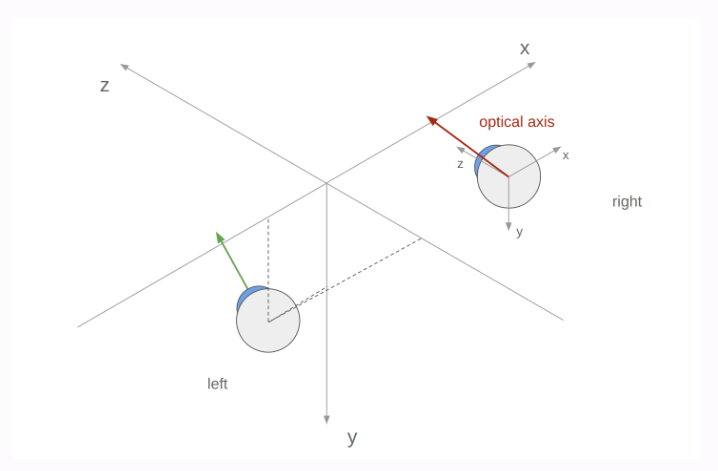
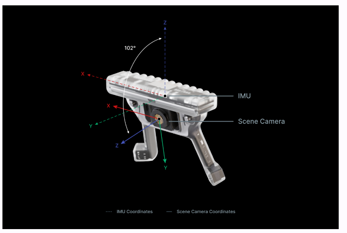
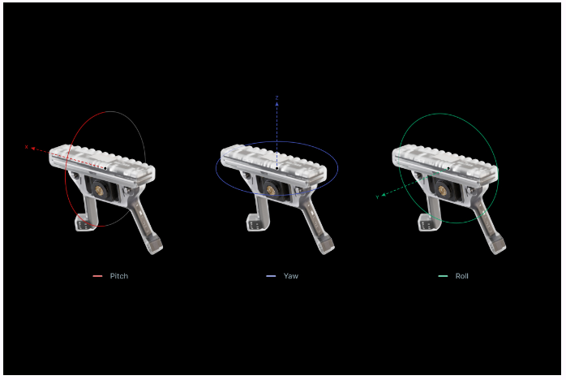
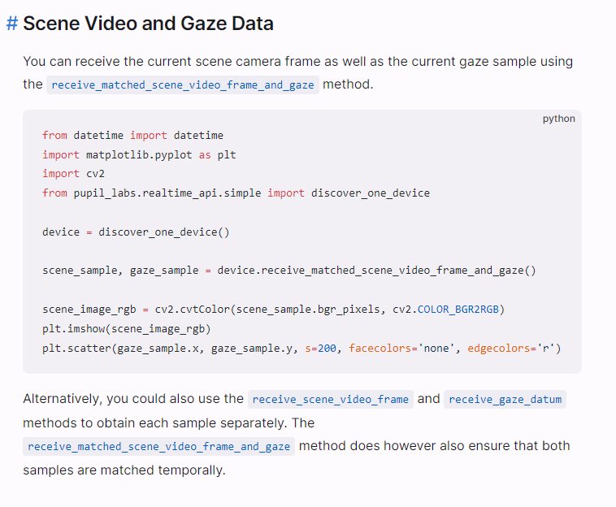
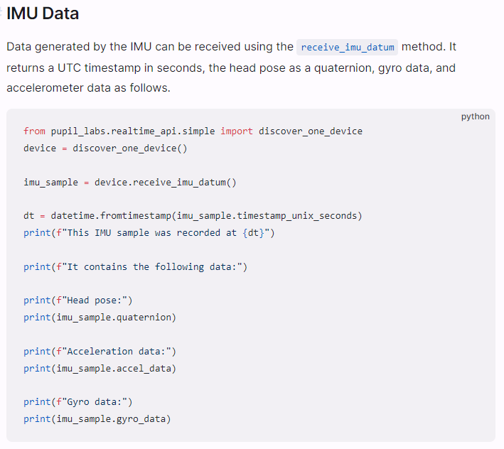

## Synopticon

### Pupil Labs
#### Sensors
1. 2x eye cameras: 200Hz 192x192 px (IR illuminates eyes so should work in dark environments as well)
    * Concatinated to one 384x192px video stream
2. Gaze: up to 200Hz, pixel spac eof the scene camera, 1600x1200px, Origin at top left corner. Gaze estimation is based on end2end deep learning. White paper to come. 
3. Fixation and saccade algorithms specifically for head-mounted eye trackers, mroe robust to movements. NB. Not sure if we have access to these.
4. Coordinate system, origin at scene camera (can specify IED of wearer to increase accuracy, otherwise population average is used): 
5. Pupil diameters at 200Hz mm size. Single value for both eyes. 
6. Blinks. Blink detection is operating directly on the eye video. Blink detector white paper available: [link](https://docs.google.com/document/d/1JLBhC7fmBr6BR59IT3cWgYyqiaM8HLpFxv5KImrN-qE/export?format=pdf)
7. Scene video: Front facing camera, 30Hz, 1600x1200px resolution. 132°x81° field of view
8. Audio recording as well. Disabled by default. Enabled in companion app?
9. Movement data from IMU 9-DoF Acc, Gyro, Mag: Need to calibrate the magnetometer. [Calibration](https://docs.pupil-labs.com/neon/data-collection/calibrating-the-imu/).
 

11.   Gaze data and camera is streamed via RTSP, using RTP and RTCP
   * Accesibble through Python API. If we want a different programming language we have to build the client ourselves. UE5 can run Python code [directly](https://dev.epicgames.com/community/learning/tutorials/k8lx/execute-python-files-in-blueprints-utilities-unreal-engine-5-tutorial). 
   * API has a simple mode or a async mode. If we can get away with simple we should. 
   * The devices announce their ips over a [channel](https://docs.pupil-labs.com/neon/real-time-api/tutorials/) 
   * Perhaps we can use websocket to connect directly and avoid python (Not for the data streams)
12. Precice synchronisation for [later](https://docs.pupil-labs.com/neon/data-collection/time-synchronization/)  


We should use the receive matched scene video frame and gaze method:  

For the IMU data: 

For scene camera calibration (Distortion correction):

You can receive camera calibration parameters using the [`get_calibration`](https://pupil-labs-realtime-api.readthedocs.io/en/stable/api/simple.html#pupil_labs.realtime_api.simple.Device.get_calibration) method. Especially the scene camera matrix and distortion coefficients are useful for undistorting the scene video.

```python
from pupil_labs.realtime_api.simple import discover_one_device

device = discover_one_device()
calibration = device.get_calibration()

print("Scene camera matrix:")
print(calibration["scene_camera_matrix"][0])
print("\nScene distortion coefficients:")
print(calibration["scene_distortion_coefficients"][0])

print("\nRight camera matrix:")
print(calibration["right_camera_matrix"][0])
print("\nRight distortion coefficients:")
print(calibration["right_distortion_coefficients"][0])

print("\nLeft camera matrix:")
print(calibration["left_camera_matrix"][0])
print("\nLeft distortion coefficients:")
print(calibration["left_distortion_coefficients"][0])